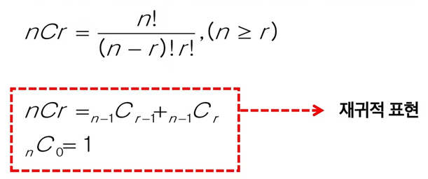
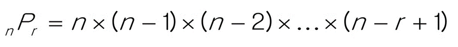

# 조합

## 🏷 기본 공식

<br/>

## 🏷 기본 코드
### 1. 재귀
```java
import java.util.Arrays;

public class Solution {
	
	static String[] 재료 = {"상추", "패티", "토마토", "치즈"};
	
	static int N, R; // 재료의 수, 내가 뽑고 싶은 재료의 수
	
	static String[] sel; // 뽑은 재료들을 저장할 배열
	
	public static void main(String[] args) {
		
		N = 4;
		R = 2;
		
		sel = new String[R];
		
		combination(0, 0);
		
	}
	
	// idx: 재료의 인덱스
    // sidx: 뽑은 재료의 인덱스
	static void combination(int idx, int sidx) {

		// 기저 조건
		if (sidx == R) {
			System.out.println(Arrays.toString(sel));
			return;
		}
		
		if (idx == N) return;
		
		// 재귀 부분
		sel[sidx] = 재료[idx];
		combination(idx + 1, sidx + 1);

		combination(idx + 1, sidx);

	}
	
}
```

### 2. 반복문 + 재귀함수
```java
import java.util.Arrays;

public class Solution {

	static String[] 재료 = { "상추", "패티", "토마토", "치즈" };
	static int N, R; // N : 재료의 수, R : 내가 뽑고 싶은 재료의 수
	static String[] sel; // 뽑은 재료들을 저장할 배열

	public static void main(String[] args) {

		N = 4;
		R = 2;
		sel = new String[R];
		
		combination(0, 0);
		
	}
	
	//idx : 재료의 인덱스
	//sidx : 뽑은 재료의 인덱스
	public static void combination(int idx, int sidx) {

		//기저조건
		if(sidx == R) {
			System.out.println(Arrays.toString(sel));
			return;
		}

		//재귀부분
		for(int i = idx; i <= N - R + sidx; i++) {
			sel[sidx] = 재료[i]; //뽑았어요~~
			combination(i + 1, sidx + 1);
		}
		
	}

}
```
<br/>
<br/>

# 순열

## 🏷 기본 공식

<br/>

## 🏷 기본 코드
### 1. 반복문
```java
public class Solution {

	static int[] nums;
	static int N;

	public static void main(String[] args) {
	
		nums = new int[] {1, 2, 3};
		N = nums.length;

		for (int i = 0; i < N; i++) {
			for (int j = 0; j < N; j++) {
			
				if(i != j) {
					for (int k = 0; k < N; k++) {
						if(i != k && j != k) {
							System.out.printf("%d %d %d\n", nums[i], nums[j], nums[k]);
						}
					}
				}
				
			}
		}
		
	}
	
}
```

### 2. Swap
```java
import java.util.Arrays;

public class Solution {
	
	static int[] nums;
	static int N;
	
	public static void main(String[] args) {
		
		nums = new int[] {0, 1, 2};
		N = nums.length;
		
		perm(0);
		
	}
	
	static void perm(int idx) {
		if (idx == N) {
			System.out.println(Arrays.toString(nums));
			return;
		}
		
		for (int i = idx; i < N; i++) {
			swap(i, idx);
			perm(idx + 1);
			swap(i, idx);
		}
	}
	
	static void swap(int idx1, int idx2) {
		int temp = nums[idx1];
		nums[idx1] = nums[idx2];
		nums[idx2] = temp;
	}
	
}
```

### 3. 방문 체크
```java
import java.util.Arrays;

public class Solution {
	
	static int[] nums;
	static int N;
	
	static boolean[] visited;
	static int[] result;
	
	public static void main(String[] args) {
		
		nums = new int[] {0, 1, 2};
		N = nums.length;
		
		visited = new boolean[N];
		result = new int[N];
		
		perm(0);
		
	}
	
	static void perm(int idx) {
		if (idx == N) {
			System.out.println(Arrays.toString(result));
			return;
		}
		
		for (int i = 0; i < N; i++) {
			if (visited[i]) continue;
			
			result[idx] = nums[i];
			visited[i] = true;
			perm(idx + 1);
			
			visited[i] = false;
		}
	}
	
}
```

### 4. 비트마스킹
```java
import java.util.Arrays;

public class Solution {
	
	static int[] nums;
	static int N;
	
	static int[] result;
	
	public static void main(String[] args) {
		
		nums = new int[] {0, 1, 2};
		N = nums.length;
		
		result = new int[N];
		
		perm(0, 0);
		
	}
	
	static void perm(int idx, int visited) {		
		if (idx == N) { // 조건문 이렇게 작성해도 된다. -> visited == (1 << N) - 1 
			System.out.println(Arrays.toString(result));
			return;
		}
		
		for (int i = 0; i < N; i++) {
			if ((visited & (1 << i)) != 0) continue;
			
			result[idx] = nums[i];
			perm(idx + 1, visited | (1 << i));
		}
	}
	
}
```